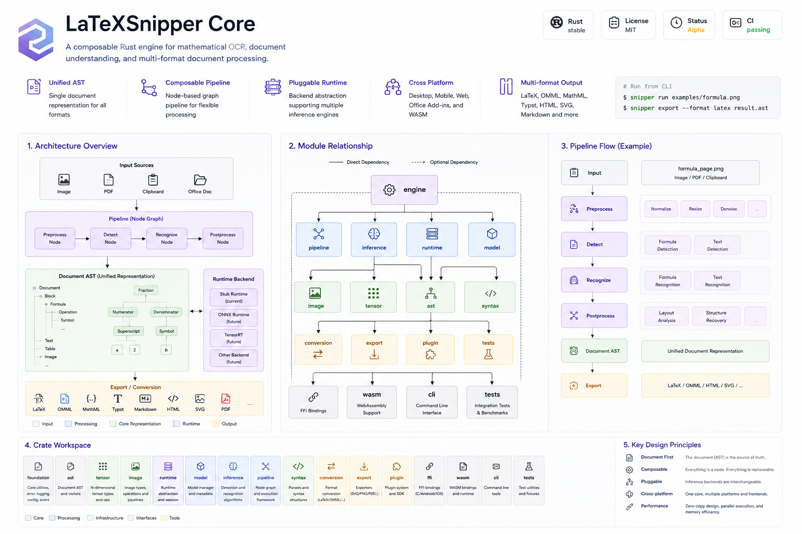
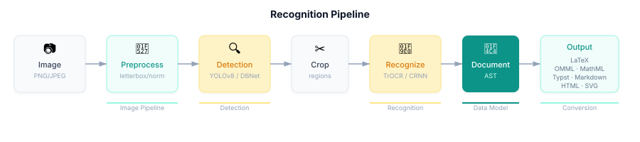

<div align="center">

# LaTeXSnipper Core

**可组合的 Rust 数学 OCR 引擎，支持文档理解和多格式处理。**

[]()
[]()
[]()
[]()

**一次构建，处处运行。**

单一 Rust 核心驱动桌面端、移动端、Office 插件和 Web 应用。

[]()

[English](README.md) · [中文](README-CN.md)

</div>

---

## 为什么选择 LaTeXSnipper Core？

| 特性 | 说明 |
|------|------|
| **平台无关** | 纯 Rust 架构，无 UI 依赖 — 可在桌面、移动端、Office 或 Web 上运行 |
| **统一文档 AST** | 文档结构的唯一数据源，独立于任何输出格式 |
| **多 OCR 运行时** | 可互换后端：ONNX Runtime、TensorRT、NCNN — 选择适合你平台的方案 |
| **多格式转换** | 从一个 AST 生成 12 种输出格式：LaTeX、OMML、MathML、Typst、Markdown、HTML |
| **流式流水线** | 异步节点图，支持取消、进度跟踪和并行执行 |
| **为各平台设计** | 桌面端（Windows/macOS/Linux）、移动端（Android/iOS）、Office 插件、Web（WASM） |

> 架构和 crate 边界已稳定。大部分实现仍在积极开发中。

---

## 架构

LaTeXSnipper Core 采用严格的**四层架构**：

| 层级 | 职责 |
|------|------|
| **Platform** | UI、相机、权限 — 属于各平台应用 |
| **Adapter** | JNI、WASM、Office.js、CLI — 将平台类型转换为 Core 类型 |
| **Core** | AST、推理、流水线、转换、导出 — 全部业务逻辑 |
| **Runtime** | ONNX Runtime、Stub — 可替换的推理后端 |

> Core 永远不知道是谁在调用它。它只关心输入、处理和输出。

---

## LaTeX 语法支持

| 特性 | LaTeX | OMML | HTML | Typst | Markdown |
|------|-------|------|------|-------|----------|
| 粗体 `\textbf{}` | ✅ | ✅ | ✅ | ✅ | ✅ |
| 斜体 `\textit{}` | ✅ | ✅ | ✅ | ✅ | ✅ |
| 下划线 `\underline{}` | ✅ | ✅ | ✅ | ✅ | — |
| 脚注 `\footnote{}` | ✅ | ⚡ | ✅ | ✅ | ✅ |
| 交叉引用 `\ref{}` | ✅ | ⚡ | ✅ | ✅ | ✅ |
| 参考文献 `\cite{}` | ✅ | ⚡ | ✅ | ✅ | ✅ |
| 定义列表 | ✅ | ✅ | ✅ | ✅ | ✅ |
| 定理/证明 | ✅ | ✅ | ✅ | ✅ | ✅ |
| 小页 minipage | ✅ | ✅ | ✅ | ✅ | — |
| 浮动体 figure/table | ✅ | ✅ | ✅ | ✅ | — |

⚡ = 占位符输出，需要 Word API 插入实际内容

### 多格式输入解析器

| 输入格式 | 解析器 | 说明 |
|----------|--------|------|
| LaTeX | `latex_parser.rs` | 完整 LaTeX 命令和环境解析 |
| OMML | `omml_parser.rs` | Office Math ML 反向解析 |
| MathML | `mathml_parser.rs` | MathML → LaTeX 转换 |
| Markdown | `markdown_parser.rs` | 标题/粗体/斜体/代码/列表/引用/公式 |
| HTML | `html_parser.rs` | 完整 HTML 标签解析 |
| Typst | `typst_parser.rs` | Typst 数学语法转换 |
| **DOCX** | `docx_reader.rs` | Word 段落/文本/图片/表格 |
| **PPTX** | `pptx_reader.rs` | PowerPoint 幻灯片/文本/形状/图片 |
| **XLSX** | `xlsx_reader.rs` | Excel 工作表/表格/共享字符串 |
| **PDF native** | `pdf_native.rs` | lopdf 内容流原生文本提取 |

### 多格式输出导出

| 输出格式 | 模块 | 说明 |
|----------|------|------|
| LaTeX | `latex.rs` | 完整 LaTeX 文档 |
| OMML | `omml.rs` | Office Math ML (Word 可编辑公式) |
| MathML | `mathml.rs` | W3C MathML |
| Markdown | `markdown.rs` | MathJax 兼容 |
| HTML | `html.rs` | MathJax 渲染 |
| Typst | `typst.rs` | 原生 Typst 语法 |
| **SVG** | `ExportService` | 视觉渲染输出 |
| **PDF** | `ExportService` | 视觉渲染输出 (printpdf) |
| **Clipboard** | `ClipboardBundle` | HTML+RTF+PlainText 多格式剪贴板 |
| **OOXML 片段** | `ooxml_fragment` | Word 正文 XML（含文本/公式/图片/表格） |
| **Office** | `OfficeInsertService` | 按应用自动选择 OMath/SVG/HTML |
| **PDF overlay** | `pdf_overlay.rs` | 在源 PDF 上叠加文本 |
| **作业报告** | `Job::persist_to_root` | artifacts/events/stages/diagnostics 持久化 |

---

## 模块依赖关系

```
Engine
  ├── Conversion (LaTeX/OMML/MathML/Typst/Markdown/HTML)
  ├── Export (SVG/Text/PDF)
  ├── Syntax (解析器 + 渲染器)
  ├── Pipeline (节点图)
  │     ├── Inference (检测 + 识别)
  │     │     ├── Runtime (ONNX/Stub)
  │     │     └── Image (解码/缩放/归一化)
  │     └── AST (文档数据模型)
  └── Model (清单 + 配置)
        └── Foundation (错误/日志/事件/配置)
```

---

## 识别流水线



```
图像 → 预处理 → 检测 → 裁切 → 识别 → 文档 AST → 输出
         │          │          │          │
     letterbox    YOLOv8    TrOCR     LaTeX/OMML
      normalize    DBNet    Beam Search MathML/Typst
```

---

## 功能列表

### 稳定版

| 能力 | 状态 | 说明 |
|------|------|------|
| **AST** | ✅ | Document → Page → Block → Inline → Formula |
| **图像** | ✅ | SnipperImage、ImageView、解码、缩放、归一化 |
| **转换** | ✅ | 6 种格式：LaTeX、OMML、MathML、Typst、Markdown、HTML |
| **语法** | ✅ | LaTeX/Typst/Markdown 解析器 + 渲染器 |
| **流水线** | ✅ | 异步节点流水线，支持取消 |
| **区域图** | ✅ | 冲突消解、ArtifactRef 路由、layout→识别器路由 |
| **CJK/Latin 归一化** | ✅ | 跨所有块类型的递归文本规范化 |

### 实验版

| 能力 | 状态 | 说明 |
|------|------|------|
| **推理** | ✅ | YOLOv8 检测、TrOCR 识别、CRNN+CTC |
| **运行时** | ✅ | ONNX Runtime（会话缓存）+ Stub |
| **引擎** | ✅ | JobQueue、Service trait、Request/Response Builder、Streaming API、ModelPackage |
| **模型** | ✅ | 清单、配置、SHA256 校验 |
| **ModelPackage** | ✅ | `ModelPackage`/`ModelExecutor` trait、惰性会话加载、流水线集成 |
| **流水线** | ✅ | 异步节点流水线 + ModelTask 抽象 + ReadingOrder + ModelPackage 回退 |
| **插件** | ✅ | Plugin trait、Registry |
| **FFI** | ✅ | Android JNI、iOS C FFI |
| **WASM** | ✅ | parse/render/convert/recognize 绑定 |
| **CLI** | ✅ | recognize/parse/render/version，文件导出 (`-o output.tex`)，格式提示，隐藏小游戏 (`snipper play`) |
| **导出** | ✅ | SVG/Text/PDF（printpdf），标题/表格/列表/代码/公式/页面选择 |
| **表格识别** | ✅ | SLANet+ / TATR 表格结构 + PP-DocLayout v3 版式检测 |
| **手写识别** | ✅ | 手写检测 + TrOCR 识别 + 后处理（数字/字母混淆修复 + 标点归一化） |
| **公式布局** | ✅ | LaTeX AST 解析 + 符号级检测 |
| **多页处理** | ✅ | PDF 解码 + 多页流水线；PDF 渲染通过 pdftoppm/mutool |
| **PDF 渲染** | ✅ | 通过 pdftoppm（poppler）或 mutool（MuPDF）渲染页面 |

---

## 工作空间

```
crates/
├── foundation/     ✅ 错误、Result、日志、配置、事件总线
├── ast/            ✅ 文档 AST — 唯一数据源（含报告、格式、trait 定义）
├── tensor/         ✅ 推理 I/O 张量
├── image/          ✅ 平台无关图像处理 + PDF 渲染
├── runtime/        ✅ RuntimeBackend + InferenceSession + ModelResolver + ModelPackage + ModelRegistry + Validation
├── model/          ✅ 模型清单、配置、SHA256 校验
├── inference/      ✅ 检测 + 识别管线 + ModelPackage 适配器
├── pipeline/       ✅ 节点化异步流水线 + PipelineArtifacts + ReadingOrder
├── syntax/         ✅ LaTeX/Typst/Markdown 解析器 + 渲染器
├── conversion/     ✅ AST → LaTeX/OMML/MathML/Typst/Markdown/HTML + DOCX/PPTX/XLSX 读取
├── export/         ✅ RenderTree → SVG/Text/PDF（printpdf），页面选择
├── engine/         ✅ SnipperEngine + JobQueue + Metrics + Hot-reload + SDK
├── api-types/      ✅ 公共 API 类型（RecognizeMode、Request、Response、StreamItem）
├── tract/          ✅ Tract-based WASM RuntimeBackend
├── plugin/         ✅ Plugin trait、Registry
├── mock/           ✅ 测试用 Fake 实现
├── ffi/            ✅ Android JNI + iOS C FFI
├── wasm/           ✅ WebAssembly 绑定
├── cli/            ✅ 命令行工具（recognize/parse/render/version/play）含作业管理
└── tests/          ✅ 集成测试
```

---

## 快速开始

### 安装 CLI

```bash
# 从 crates.io 安装
cargo install latexsnipper-cli

# 或从源码构建
cargo build --release -p latexsnipper-cli
```

### 作为库使用

```toml
[dependencies]
latexsnipper-engine = "1.0"
```

```rust
use latexsnipper_engine::sdk::Snipper;

let snipper = Snipper::from_file("input.png")?;
let latex = snipper.to_latex()?;
```

### 运行示例

```bash
# 解析 LaTeX
snipper parse --latex '$\frac{a+b}{c}$'

# 从图片识别
snipper recognize -i image.png -f latex -o output.tex

# 运行全部测试
cargo test --workspace
```

详见 [docs/getting-started.md](docs/getting-started.md)。

---

## 文档

### 架构

| 文档 | 说明 |
|------|------|
| [architecture.md](docs/architecture.md) | 四层架构总览 |
| [pipeline.md](docs/pipeline.md) | 识别流水线设计 |
| [runtime.md](docs/runtime.md) | 运行时后端系统 |
| [engine.md](docs/engine.md) | 引擎和任务队列 |

### 开发者指南

| 文档 | 说明 |
|------|------|
| [getting-started.md](docs/getting-started.md) | 开发者入门指南 |
| [plugin.md](docs/plugin.md) | 插件系统 |
| [testing.md](docs/testing.md) | 测试策略 |

### 参考

| 文档 | 说明 |
|------|------|
| [ast.md](docs/ast.md) | 文档 AST 规范 |
| [syntax.md](docs/syntax.md) | LaTeX/Typst/Markdown 解析器 |
| [conversion.md](docs/conversion.md) | 12 种输出格式 |

### 路线图

| 文档 | 说明 |
|------|------|
| [dual-track.md](docs/dual-track.md) | 开发路线图 |

---

## 设计原则

- **文档优先** — 文档是数据源，不是 LaTeX 或 OCR
- **可组合** — 一切都是节点，一切都是流水线
- **平台无关** — 业务逻辑在 Rust，UI 在外部
- **运行时可插拔** — ONNX、TensorRT、NCNN 全部可替换

---

## 模型

LaTeXSnipper Core 使用 ONNX 模型进行公式检测/识别和文本检测/识别。

### 支持的模型

| 模型 | 大小 | 用途 | 来源 | 许可 |
|------|------|------|------|------|
| YOLOv8-MFD | ~66 MB | 公式检测 | [Mathcraft](https://github.com/SakuraMathcraft/LaTeXSnipper) | MIT |
| TrOCR-DeiT | ~104 MB | 公式识别（编码器+解码器） | [Microsoft TrOCR](https://huggingface.co/microsoft/trocr-base-handwritten) | MIT |
| PP-OCRv6 Det | ~10 MB | 文本检测 | [PaddleOCR](https://github.com/PaddlePaddle/PaddleOCR) | Apache-2.0 |
| PP-OCRv6 Rec | ~21 MB | 文本识别（18709 字符：中/英/数学/希腊） | [PaddleOCR](https://github.com/PaddlePaddle/PaddleOCR) | Apache-2.0 |
| OpenOCR Mobile Det | ~9 MB | 文本检测（OpenOCR mobile DBNet） | [OpenOCR](https://github.com/Topdu/OpenOCR) | Apache-2.0 |
| OpenOCR Mobile Rec | ~21 MB | 文本识别（OpenOCR mobile CTC） | [OpenOCR](https://github.com/Topdu/OpenOCR) | Apache-2.0 |
| PP-DocLayout v3 | ~13 MB | 文档版式分析（10 类） | [RapidAI/RapidLayout](https://github.com/RapidAI/RapidLayout) | Apache-2.0 |
| TATR Detection | ~34 MB | 表格区域检测（DETR 架构） | [Microsoft Table Transformer](https://github.com/microsoft/table-transformer) | MIT |
| TATR Structure | ~34 MB | 表格结构识别（行列单元格） | [Microsoft Table Transformer](https://github.com/microsoft/table-transformer) | MIT |
| SLANet Plus | ~7 MB | 表格结构识别（替代后端） | [RapidAI/RapidTable](https://github.com/RapidAI/RapidTable) | Apache-2.0 |

### 模型目录结构

```
models/
├── formula-det/yolov8-mfd/     # 公式检测 — 稳定
├── formula-rec/trocr-deit/     # 公式识别 — 稳定
├── text-det/v6-small/          # 文本检测 — 稳定
├── text-det/openocr-mobile/    # 文本检测（OpenOCR mobile）— 实验
├── text-rec/v6-small/          # 文本识别 — 稳定
├── text-rec/openocr-mobile/    # 文本识别（OpenOCR mobile）— 实验
├── layout/
│   └── pp-layout-cdla/         # 文档版式分析（CDLA）— 稳定
├── table-det/
│   ├── tatr-detection/         # 表格检测 — 实验
│   └── doclayout-v3/           # 文档版式分析 — 实验
├── table-struct/
│   ├── tatr-structure/         # 表格结构 — 实验
│   └── slanet-plus/            # 表格结构（替代后端）— 实验
└── doc-ori/                    # 文档方向分类 — 实验
```

### 模型支持状态

| 模型 | 状态 | 默认 | Release |
|---|---|---|---|
| YOLOv8-MFD | 稳定 | 是 | models-v2.0.0 |
| TrOCR-DeiT | 稳定 | 是 | models-v2.0.0 |
| PP-OCRv6 Det (v6-small) | 稳定 | 是 | models-v2.0.0 |
| PP-OCRv6 Rec (v6-small) | 稳定 | 是 | models-v2.0.0 |
| OpenOCR Mobile Det | 实验 | 否 | models-v2.0.0 |
| OpenOCR Mobile Rec | 实验 | 否 | models-v2.0.0 |
| PP-DocLayout v3 | 实验 | 否 | models-v2.0.0 |
| TATR Detection | 实验 | 否 | models-v2.0.0 |
| TATR Structure | 实验 | 否 | models-v2.0.0 |
| SLANet Plus | 实验 | 否 | models-v2.0.0 |
| PP-LCNet（doc/textline ori） | 实验 | 否 | 仅 test-models |

> 注意：`test-models/` 目录包含正在测试的模型，请勿修改。

---

## 相关项目

- [LaTeXSnipper Mobile](https://github.com/strangelion/LaTeXSnipper_mobile) — Android 应用
- LaTeXSnipper Office — Office 插件
- [LaTeXSnipper 桌面端](https://github.com/SakuraMathcraft/LaTeXSnipper)
- LaTeXSnipper Web — Web 端（规划中）

所有项目共享同一个 Rust Core。

---

## 许可证

GNU AGPL-3.0。允许学习和个人使用，禁止闭源商业化分发。修改后分发或网络服务必须公开全部源码。
