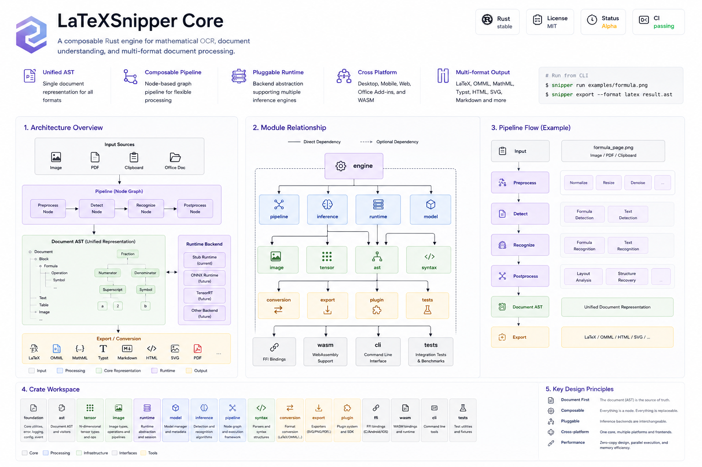
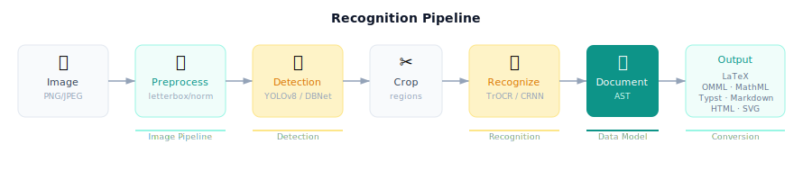

<div align="center">

# LaTeXSnipper Core

**A composable Rust engine for mathematical OCR, document understanding, and multi-format document processing.**

[]()
[]()
[]()
[]()

**Build once. Run everywhere.**

A single Rust core powering Desktop, Mobile, Office Add-ins and Web applications.

[]()

[English](README.md) · [中文](README-CN.md)

</div>

---

## Architecture

LaTeXSnipper Core follows a strict **four-layer architecture**:

| Layer | Responsibility |
|-------|---------------|
| **Platform** | UI, Camera, Permissions — belongs to each app |
| **Adapter** | JNI, WASM, Office.js, CLI — translates platform types to Core types |
| **Core** | AST, Inference, Pipeline, Conversion, Export — all business logic |
| **Runtime** | ONNX Runtime, Stub — interchangeable inference backends |

> Core never knows which platform is calling it. It only cares about input, processing, and output.

---

## Module Dependencies

```
Engine
  ├── Conversion (LaTeX/OMML/MathML/Typst/Markdown/HTML)
  ├── Export (SVG/Text)
  ├── Syntax (Parser + Renderer)
  ├── Pipeline (Node Graph)
  │     ├── Inference (Detection + Recognition)
  │     │     ├── Runtime (ONNX/Stub)
  │     │     └── Image (Decode/Resize/Normalize)
  │     └── AST (Document Data Model)
  └── Model (Manifest + Config)
        └── Foundation (Error/Log/Event/Config)
```

---

## Recognition Pipeline



```
Image → Preprocess → Detection → Crop → Recognition → Document AST → Output
           │              │              │              │
       letterbox       YOLOv8        TrOCR/CRNN     LaTeX/OMML
        normalize       DBNet         Beam Search    MathML/Typst
```

---

## Features

| Capability | Status | Details |
|-----------|--------|---------|
| **AST** | ✅ | Document → Page → Block → Inline → Formula |
| **Image** | ✅ | SnipperImage, ImageView, decode, resize, normalize |
| **Inference** | ✅ | YOLOv8 detection, TrOCR recognition, CRNN+CTC |
| **Pipeline** | ✅ | DAG Node Graph, YAML/JSON Manifest, async with cancellation |
| **Conversion** | ✅ | 12 formats: LaTeX, OMML, MathML, Typst, Markdown, HTML |
| **Export** | ✅ | SVG, Text, PDF generators |
| **Runtime** | ✅ | ONNX Runtime (with session caching) + Stub |
| **Model** | ✅ | Manifest, Config, SHA256 verification |
| **Syntax** | ✅ | LaTeX/Typst/Markdown Parser + Renderer |
| **Plugin** | ✅ | Plugin trait, Registry, Request/Response |
| **Engine** | ✅ | JobQueue, Service trait, Request/Response Builder, Streaming API |
| **FFI** | ✅ | Android JNI, iOS C FFI (OnnxRuntimeBackend) |
| **WASM** | ✅ | parse/render/convert/recognize bindings |
| **CLI** | ✅ | recognize/parse/render/version |

---

## Workspace

```
crates/
├── foundation/     Error, Result, Logger, Config, EventBus
├── ast/            Document AST — single source of truth
├── tensor/         Inference I/O tensors
├── image/          Platform-independent image processing
├── runtime/        RuntimeBackend + InferenceSession traits
├── model/          Model manifest, config, management
├── inference/      Detection + Recognition pipelines
├── pipeline/       Node-based async pipeline
├── syntax/         LaTeX/Typst/Markdown Parser + Renderer
├── conversion/     AST → LaTeX/OMML/MathML/Typst/Markdown/HTML
├── export/         RenderTree → SVG/Text/PDF
├── engine/         SnipperEngine + JobQueue + Service
├── plugin/         Plugin API (Plugin trait, Registry)
├── mock/           Fake implementations for testing
├── ffi/            Android JNI + iOS C FFI
├── wasm/           WebAssembly bindings
├── cli/            CLI tool
└── tests/          Integration tests (70 tests)
```

---

## Getting Started

```bash
# Build
cargo build

# Run CLI
cargo run -p latexsnipper-cli -- parse --latex '$\frac{a+b}{c}$'

# Run all tests
cargo test --workspace
```

See [docs/getting-started.md](docs/getting-started.md) for details.

---

## Documentation

| Document | Description |
|----------|-------------|
| [architecture.md](docs/architecture.md) | Four-layer architecture overview |
| [inference.md](docs/inference.md) | Detection + Recognition parameters |
| [model.md](docs/model.md) | Model config, manifest, directory structure |
| [conversion.md](docs/conversion.md) | 12 output formats |
| [plugin.md](docs/plugin.md) | Plugin system |
| [getting-started.md](docs/getting-started.md) | Developer guide |

---

## Design Principles

- **Document First** — The document is the source of truth, not LaTeX or OCR
- **Composable** — Everything is a Node, everything is a Pipeline
- **Platform Independent** — Business logic in Rust, UI outside
- **Pluggable Runtime** — ONNX, TensorRT, NCNN — all interchangeable

---

## Related Projects

- [LaTeXSnipper Mobile](https://github.com/strangelion/LaTeXSnipper_mobile) — Android app
- LaTeXSnipper Office — Office Add-in
- [LaTeXSnipper Desktop](https://github.com/SakuraMathcraft/LaTeXSnipper) — Desktop app
- LaTeXSnipper Web — Web app (planned)

All share the same Rust Core.

---

## License

GNU AGPL-3.0. 学习和个人使用允许，禁止闭源商业化分发。
