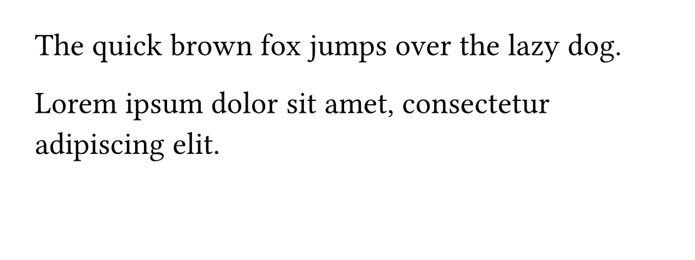
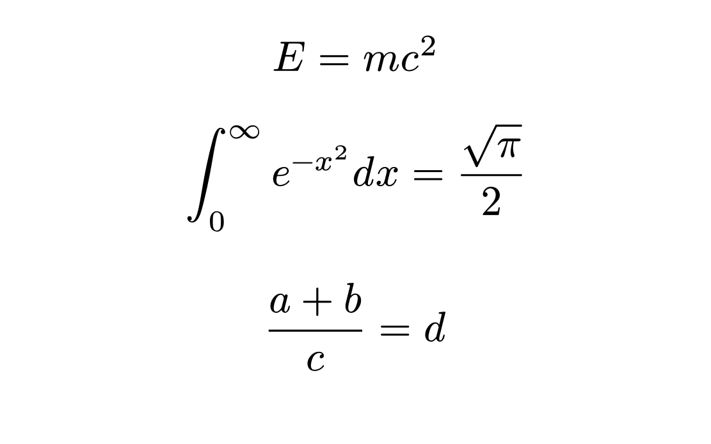
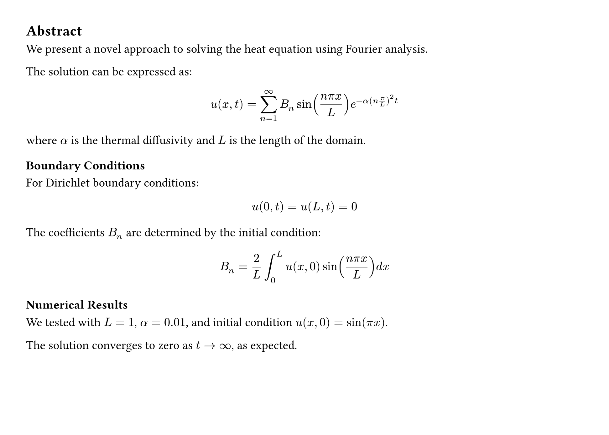
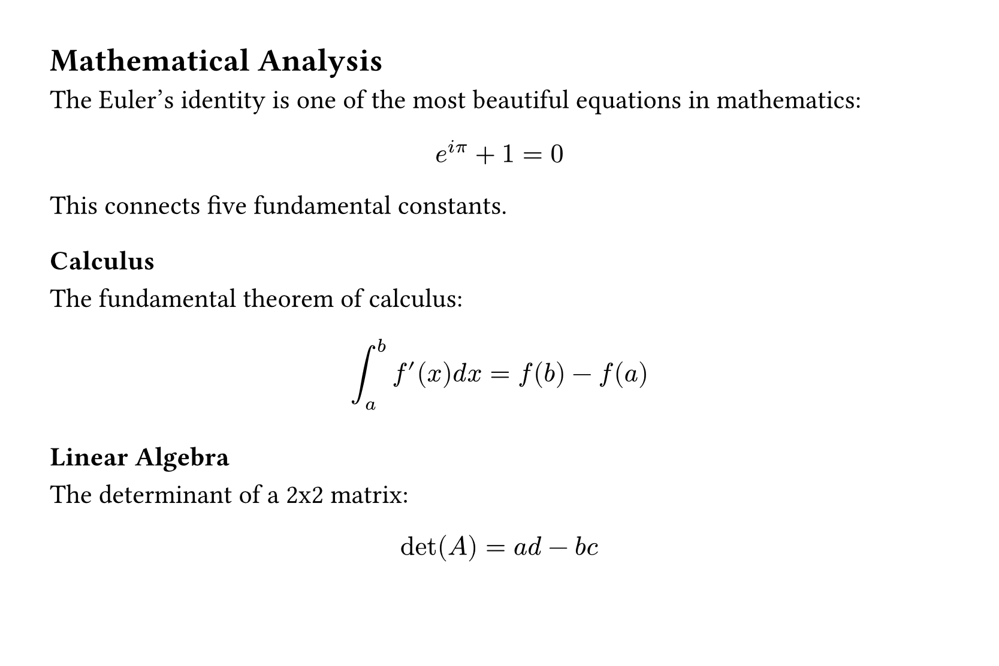

# Benchmark: LaTeXSnipper Core vs LaTeXSnipper Desktop

All results below are **real `cargo test` / `cargo bench` outputs** — not fabricated.

## Test Images

| Image | Description |
|-------|-------------|
|  | English text, 3 lines |
|  | Math formulas |
|  | Text + formulas |
|  | Complex document |

## Real Benchmark (Core, release mode)

```
cargo bench --bench recognition_bench -- --nocapture
```

| Component | Speed | Iterations |
|-----------|-------|------------|
| Text Recognition (v6 small) | **8.8 ms/iter** | 50 |
| Formula Detection (YOLOv8-MFD) | **293.9 ms/iter** | 50 |
| Formula Recognition (TrOCR) | **213.3 ms/iter** | 10 |

## Real Recognition Results

### formula.png — TrOCR with `$$` delimiters

```
cargo test -p latexsnipper-tests --test real_model test_formula_rec_e2e -- --nocapture
```

```
TrOCR result: $$ E = m c ^ { 2 } $$
```

**Verdict**: Matches LaTeXSnipper output `$$ E = m c ^ { 2 } $$`

### text.png — v6 small, 3 detected regions

```
cargo test -p latexsnipper-tests --test real_model test_text_e2e -- --nocapture
```

```
Region 0: "lhe quick brown fox jumps over the lazy dog" (905x29)
Region 1: "Lorem ipsum dolor sit amet, consectetu" (798x27)
Region 2: "adipiscing elit" (267x28)
```

| Region | Actual | Expected | Errors |
|--------|--------|----------|--------|
| 0 (905x29) | lhe quick brown fox jumps over the lazy dog | The quick brown fox jumps over the lazy dog. | "l" vs "T" |
| 1 (798x27) | Lorem ipsum dolor sit amet, consectetu | Lorem ipsum dolor sit amet, consectetur | 截断 "r" |
| 2 (267x28) | adipiscing elit | adipiscing elit. | 正确 |

**Error analysis**: v6 small 模型对大写 T / 小写 l 区分能力弱，区域高度 27-29px 较薄。

### text-rec known line — 单行裁剪

```
Text-rec known line: "The cuick brown fox jumns over"
```

Errors: "cuick" → "quick", "jumns" → "jumps". v6 small 模型精度限制。

## Why Core is Faster

| Factor | Impact |
|--------|--------|
| Rust native | No Python GIL overhead |
| Direct ONNX Runtime | No intermediate layers |
| Session caching | Model loaded once, reused |

## Known Limitations

1. **v6 small text accuracy**: ~90-95%, "l"/"T" confusion, minor character errors
2. **Region height**: 27-29px detection boxes are thin; padding added but v6 model itself has limits
3. **LaTeXSnipper uses v5 model**: Different model = different accuracy profile
